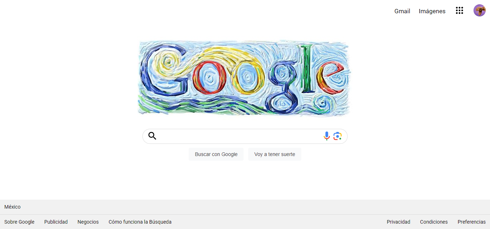

# Mi clon  de Google de Tecnolochicas PRO

Este clon de Google es desarrollado para poner en práctica los conceptos principales de HTML y CSS aprendidos dentro del Bootcamp de desarrollo front-end.

Fue desarrollado con HTML y CSS.

[Proyecto en línea](https://helpful-bonbon-23fce6.netlify.app/)

- Capturas de pantalla

- Tecnologías

* HTML
* CSS

- Creado por Maria Xitlali Valenzo Serna en el bootcamp de Tecnolochicas Pro